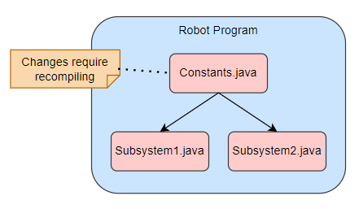
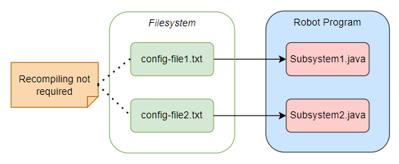

# Background

<hr>

Consider this scenario: you're writing a simple program that rotates a servo a certain number of degrees (maybe to actuate an arm).  You don't know exactly how many degrees it will be exactly, so you initially guess 90°.  You hard code the value.

So you test it out, aaaaand... crap.  It was too much! You change it to 80° and try again.

Now it's too little! Ok, so it's somewhere in between, 85° maybe? You try this again and again until you hone in on the perfect value, which turns out to be 83.5°.  You finally got the right value, but guessing and checking was tedious.

Sound familiar?

Developing software for dynamic configuration is often ignored due to the short-term cost.  However, the accumulated time-savings far outweigh initial development time. 

<hr>

## Characterizing the Problem

When building robots, parameters in the software will have to be tested against reality and tweaked on the fly.  However, when parameters are hard coded, making changes is not easy.  One has to: 

1. Locate the parameter(s)
2. Make the change(s)
3. Re-build and deploy to the robot

One strategy to make the first step easier is to use a `Constants.java` file containing all parameters with the modifiers `static final`. Those parameters are then used in a fashion just like global variables.  This strategy has some issues though:

- Deeply nested namespaces (e.g. `Constants.Subsystem.Motor1.PID.kI`)
   - Too much verbosity can be overbearing 
- Lack of obvious compartmentalization
   - As the size of `Constants.java` grows, readability decreases

Worst of all, any changes require re-deployment!  Even making one or two small changes will mean time wasted waiting for code to re-build and then upload to your robot. We need a more efficient strategy! 

One could object: 

> "We already have a more efficient strategy, we can tweak variables live with Shuffleboard!

It's not that tweaking live is not useful; it has its place.  But there is a cost to the extra flexibility, and that cost is computational bandwidth.  Such flexibility should be stringently reserved.  Besides, _most_ parameters do not need it:

- CAN IDs
- Motor PIDs
   - Live tweaks might be useful initially
- Limelight settings
- Motor positions or speeds

The goal is to increase flexibility without sacrificing bandwidth.

<hr>

## Parameterization

Observe that `Constants.java` contains values initialized once and only once: during program startup.  We can move these values into _configuration_ files.  

```{important}
When we use configuration files, the software does not need to be recompiled!  This means we don't have to re-deploy code.
```

```{tab} Hard Coded

```

```{tab} Dynamic

```

After the parameters are moved out of the program into a configuration file, making updates is simpler.  All one has to do is upload the configuration files to the target and restart the robot program.

```{note}
The FRC Driver Station has a built-in button to restart robot code. 
```