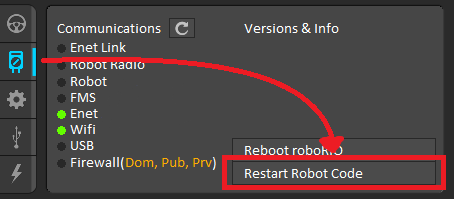

# Implementation

<hr>

## Usage

Battleaid offers `LoadableConfig` to make defining and loading configuration files simple. `LoadableConfig` will automatically initialize class fields when an instance of the configuration is created.  This encourages reuse and supports scalability.

<hr>

### I. Defining Configurations

To define a configuration, you must create a class that meets these requirements: 

1. The class shall extend `LoadableConfig`.
2. All fields in the class shall be declared `public` and uninitialized.
3. Fields shall be typed as one of the following:
    - Java primitive
    - `String`
    - A class that extends `LoadableConfig` (_nested_ configs)
3. The class shall contain a `public` constructor with a single parameter `String filename` that calls `super.load(this, filename)`.
4. Nested config definitions shall have an empty, `public` constructor and no other constructors.  
6. Nested config definitions shall be outside the scope of the encompassing config definition.

For example:

```{code-block} java
:linenos:

// ExampleConfig.java
public class ExampleConfig extends LoadableConfig {
    public double d;
    public byte b;
    public int i;
    public float f;
    public boolean flag;
    public char c;
    public short s;
    public long l;
    public String str;
    public NestedConfig nstd1;
    public NestedConfig nstd2;

    public ExampleConfig(String filename) {
        super.load(this, filename);
    }
}
```

```{code-block} java
:linenos:

// NestedConfig.java
public class NestedConfig extends LoadableConfig {
    public int that; 
    public float is;
    public boolean cool;

    public NestedConfig(){};
}
```

```{note}
Optionally, one can call `LoadableConfig.print(this)` to debug the class contents. 
```

```{warning}
`LoadableConfig` does not yet support arrays!
```

<br>

### II. Creating Configuration Files

`LoadableConfig` uses [`TOML`](https://toml.io/en/) for configuration files.  To make a configuration file, you must create a file that meets these requirements:

1. The file shall be located under `src/main/deploy/configuration` and have the extension `.toml`.
2. The file shall contain all fields defined in the class to be initialized.
3. The identifier shall be identical to the identifier of the class field.
4. Table identifiers shall be identical to identifiers of class fields that are nested configs.
5. Tables shall contain all fields defined in the nested config.

Using the `ExampleConfig` from above, a configuration file might be the following: 

```{code-block} toml
:linenos:

# example-config.toml
str = "Hello, world!"
flag = true

# order doesn't matter!
f = 3.14kkj
d = 1.6181

# read the toml standard for details
b = 0b1010_0101
s = 0xFE
i = 1_000
l = 999_999_999

[nstd1]
that = 99
is = 2.71828
cool = true

[nstd2]
that = 1
is = 0.0
cool = false
```

<br>

### III. Utilizing the Config

Time to use our config!

```{code-block} java
:linenos:

// RobotContainer.java
public class RobotContainer { 
    public RobotContainer(){
        ExampleConfig cfg = new ExampleConfig("example-config.toml");

        // this subsystem needs that config!
        SomeSubsystem ss = new SomeSubsystem(cfg);
    }
}
```

<hr>

## Making Changes

### Setup Gradle

```{admonition} TODO
:class: note

Provide gradle task for deploying the configuration directory.
```

### Steps

1. Make a change in your `*.toml`.
2. Run `./gradlew deployConfig` in your terminal.
3. Restart robot code:

<div style="text-align:center">


</div>

```{tip}
You can verify deployed contents by using `ssh`. 
```

<hr>

## Notes

### I. 

An effective strategy is to combine a subsystem with a configuration.  You can nest the config class in a subsystem class by adding the `static` modifier:

```{code-block} java
:linenos:

// ExampleSubsystem.java
public class ExampleSubsystem {
    private ExampleSubsystem.Config cnfg;

    public static class Config {
        public int some_data; 

        public Config(String filename){
            super.load(this, filename);
        }
    }

    public ExampleSubsystem(ExampleSubsystem.Config cnfg)
    {
        this.cnfg = cnfg;
    }
}
```

```{code-block} java
:linenos:

// RobotContainer.java
public class RobotContainer { 
    public RobotContainer(){
        // now the semantic meaning of the config is embedded
        // into the namespacing of our program 
        ExampleSubsystem.Config cnfg = new ExampleSubsystem.Config("config.toml");
        ExampleSubsystem ss = new ExampleSubsystem(cnfg);
    }
}
```