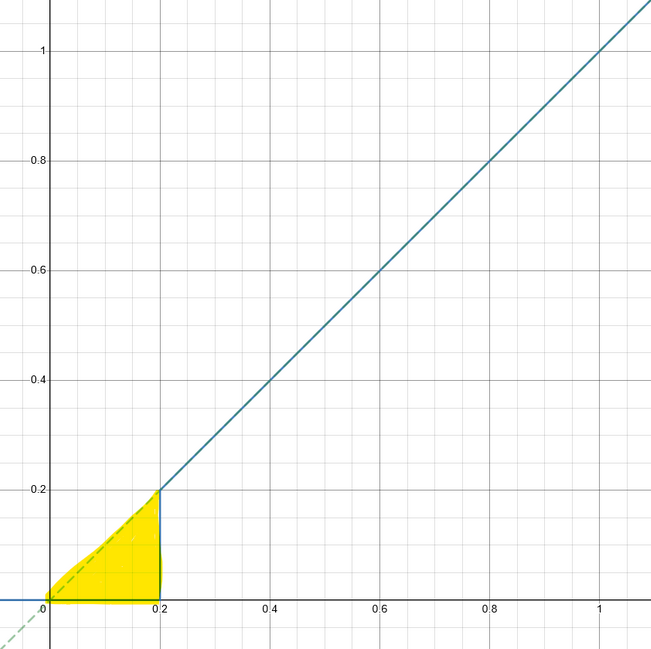
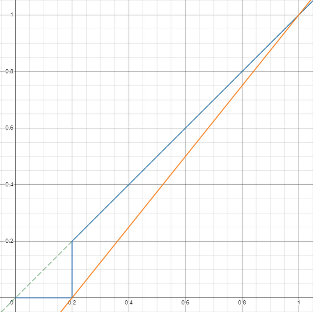
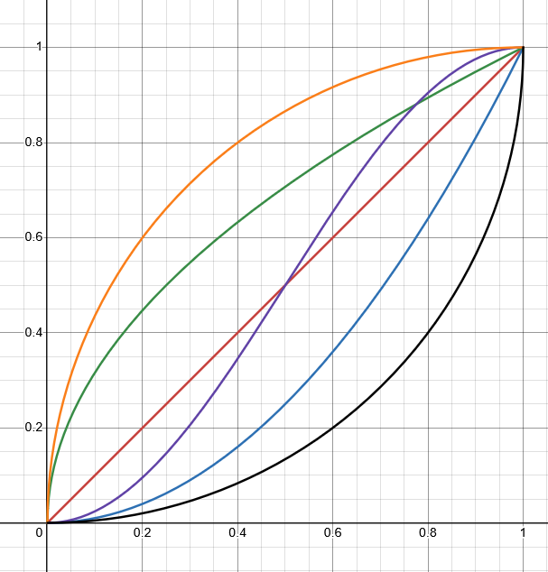

# Background

<hr>

What is the most important part of an FRC team?  There are so many key aspects that there is no single answer.  However, most people would agree that the driver(s) plays a vital role in a team's success.  It is _essential_ that the driver is able to control his/her robot with maximum precision.  _This can not be stressed enough_.  What can we do with software to aid the driver?

Often overlooked yet glaringly obvious is also what is right in your hands: the controller joysticks.

Manipulating joystick inputs effectively can:

- Prevent driver overshoot
- Enhance micro-adjustment accuracy and control
- Customize the 'feel' for the user

<hr>

## Deadzones

Every controller is an imperfect device.  Due to hardware imperfections at the microscopic scale, when a joystick returns to the neutral position, the joystick does not usually map to exactly `0.0` input.  So, it is common to have a 'deadzone' (also called a 'deadband'), where any input less than the deadzone is mapped to zero.  Here is some naive pseudocode with a 20% deadzone:

```{code-block} java
:linenos:

double user_input = controller.getRightX();

if(user_input < 0.2){
    user_input = 0;
}
```

If graphed with the input on the {math}`x` axis and the output on the {math}`y` axis:

<br>

<div style="text-align:center">


</div>

<br>

The area highlighted in yellow is the input where precision control is lost.  This poses an issue; **the user is limited to a minimum input of 20%!** If used for the drivetrain, this will lead to driver overshoot, and in general inhibits the user's ability to make fine precision adjustments that are critical for game-piece acquisition or scoring opportunities.

One could object:

> "A 20% deadzone is very large!  A more typical deadzone is 5%."

Even with a small deadzone, it is always preferred to offer the user maximum flexibility if the performance cost is small.  In reality, we need a better algorithm.

What we really want is something more like this:

<br>

<div style="text-align:center">


</div>

<br>

That's much better.  The orange line, a linear interpolation of the blue line, is the more natural expectation of deadzone characteristics.  With some range checking, we can apply a deadzone _without_ sacrificing precision.

<hr>

## Response Curves

Response curves are functions that will magnify the input in a non-linear fashion.  Response curves also allow one to customize the 'feel' of a joystick.  In general, the most applicable response curves, specifically for drivetrains, are exponential.  This is because they reduce input on the low end, allowing a user to more easily make micro-adjustments, and accelerate the input towards the high end, so that maximum output is not inhibited. Some exponential curves are shown below: 

<br>

<table class="table" style="margin-left: auto; margin-right: auto; table-layout: auto;">
  <tr>
    <td style="padding-right: 30px;">

| Curve     |
|-----------|
| 🟥 {math}`x^1` |
| 🟩 {math}`x^{1.48}` |
| 🟪 {math}`x^{1.64}` |
| 🟦 {math}`x^2` |    
| ⬛ {math}`x^3` |    
</td>
    <td>

   <div style="text-align:right">


</div>
</td>
  </tr>
</table>

<br>

A response curve in combination with a deadzone is _extremely_ effective.  One can simultaneously ignore hardware imperfections and enhance micro-adjustment capability.
