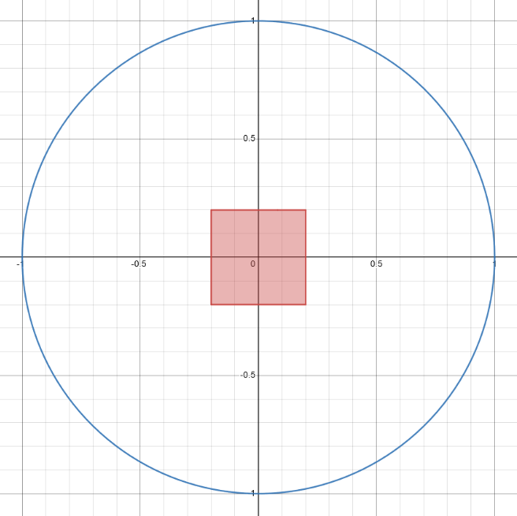
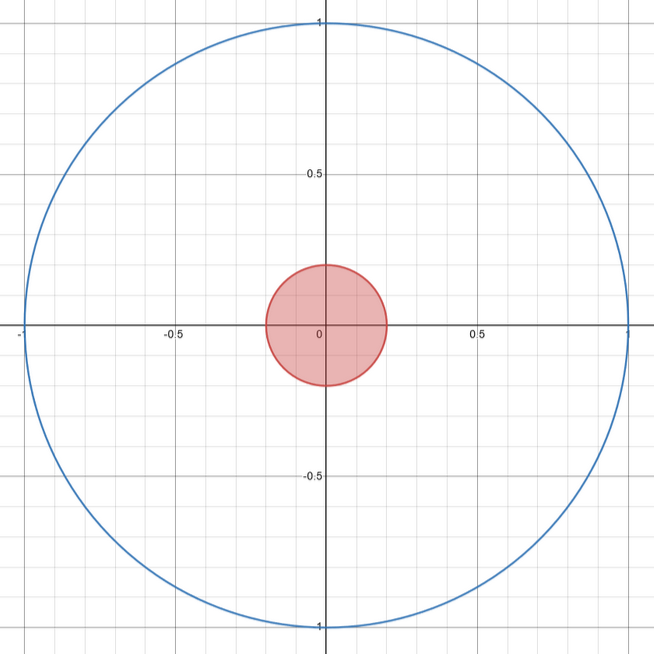

# Implementation

<hr>

## Usage

Battleaid offers `TunedJoystick` to make using deadzones and response curves intuitive with minimal performance overhead.

```{code-block} java
:linenos:

// create a controller like normal
CommandXboxController controller = new CommandXboxController(0);

// then use the same controller handle
TunedJoystick tunedJoystick = new TunedJoystick(controller.getHID())
            .useResponseCurve(ResponseCurve.SOFT)
            .setDeadzone(0.1d);
```

Then, you can use the object to retrieve the joystick values:

```{code-block} java
:linenos:
:lineno-start: 8

// these values are tuned
tunedJoystick.getRightX();
tunedJoystick.getRightY();
tunedJoystick.getLeftX();
tunedJoystick.getLeftY();
```

<hr>

### Notes

#### I.

`TunedJoystick` was created with the intention to be used for drivetrain joysticks, so the only `ResponseCurves` are exponential.  

<table class="table" style="margin-left: auto; margin-right: auto; table-layout: auto;">
  <tr>
    <td style="padding-right: 30px;">

| Enum | Curve | 
|-|-|
| {code}`ResponseCurve.LINEAR`    | 🟥 {math}`x^1` |
| {code}`ResponseCurve.VERYSOFT`  | 🟩 {math}`x^{1.48}` |
| {code}`ResponseCurve.SOFT`      | 🟪 {math}`x^{1.64}` |
| {code}`ResponseCurve.QUADRATIC` | 🟦 {math}`x^2` |    
| {code}`ResponseCurve.CUBIC`     | ⬛ {math}`x^3` |
</td>
    <td>


</td>
  </tr>
</table>

#### II.

`TunedJoystick` uses a square deadzone instead of a circular deadzone because:

1. A square deadzone is simpler to implement.
    - Circular deadzone requires checks on the {math}`x` and {math}`y` axis, while a square deadzone does not.
2. A circular deadzone is more computationally expensive.
    - The vector magnitude of user input needs to be computed.
3. Deadzones will generally not be big enough for the difference to be noticed by users.
    - Area grows exponentially to perimeter.

| Square | Circular |
|-|-|
|  |  | 