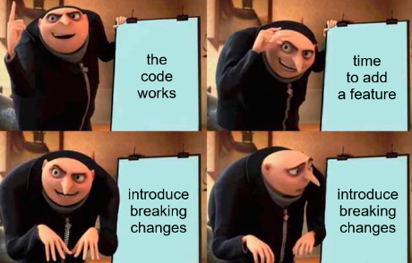

# Version Control

<hr> 

Not doing version control is like playing a video game but every time you die you go back to the tutorial. It's just stupid.  I think this meme speaks for itself:

<div style="text-align:center">


</div>

If you didn't already do version control, hopefully you want to now.

<hr>

## Background

Unfortunately, fully appreciating version control's value is something that only comes with time and making mistakes.  Despite it's necessity, it's often ignored.

But it shouldn't be.  What team hasn't had to revert code at the last minute and scramble to find the previous 'working' version?  Even the term 'working' is misleading; we really mean a known, _replicatable_, and _predictable_ state.

Fortunately, tools like `git` were created to solve this problem.  If you're not already using `git`, you should be.  

<hr>

## Implementation

In order to accurately debug what is happening on a robot, it is useful to know what version of the software is running.  If we could uniquely identify the code we deploy to our robot, we would have a much easier time finding the root cause of failures.  Some very kind people on the internet have created tools that will handle this for you.  It does require your code to be in a `git` repository (which you should already be doing).

In your `build.gradle`, add this plugin:

```{code-block} 
plugins {
    # . . . 
    id "com.peterabeles.gversion" version "1.10"
}
```

Then, add this below your plugins to create a version file: 

```{code-block}
project.compileJava.dependsOn(createVersionFile)
gversion {
    srcDir       = "src/main/java/"
    classPackage = "<your-package-here>" # e.g. frc.robot
    className    = "BuildVersion"
    dateFormat   = "yyyy-MM-dd HH:mm:ss z"
    timeZone     = "CST"
    langauge     = "java"
    indent       = "    "
}
```

```{note}
Make sure you update the values to suit your team/project. <br>
You should check to see if there is a newer version of the plugin.
```

If you want to know more about the plugin, go to the [GitHub page](https://github.com/lessthanoptimal/gversion-plugin).

```{tip}
You may need to add the version file to your `.gitignore`!
```

